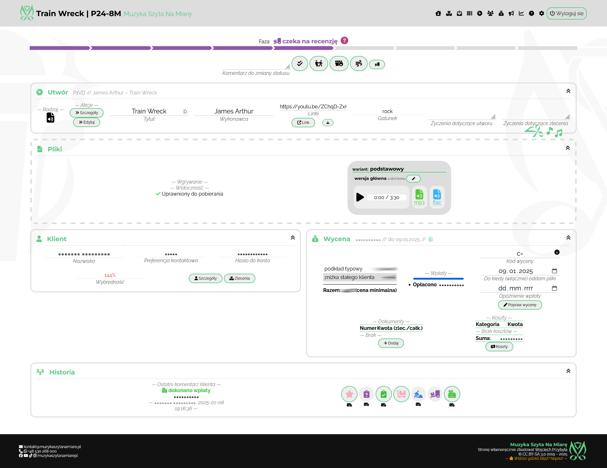

You are looking at contents of my new website to handle my business of making backing tracks 🔈 and sheet music 🎶 Its goal is to make the original website (see the other repo here, should be called **projects**) *nicer*, *smoother* and *more functional*.

It is made with **Laravel** and was inspired by the sudden realization at the end of my Bachelor's that I should keep up with the technology 🏃 Which was rather a large leap but I made it nonetheless 🥳

## Features
This website serves as a CRM for my business and as such is equipped with:
- ⭐ nice and informative front page
- 🔑 password-only client login
- 📧 mailing system
- 📦 handling of commissions (registering, phases, comments)
- 📺 audio/video file repository
- ⏰ automated messages and commission expiry
- 🗃️ invoice generation
- 📊 statistics and graphs

## Links
This website is available [here](https://muzykaszytanamiare.pl/).
To browse the backend as an observer, you can log in with the password `MSZNMOBSERVER`.

## Screenshots
This is how the app looks from the back:

